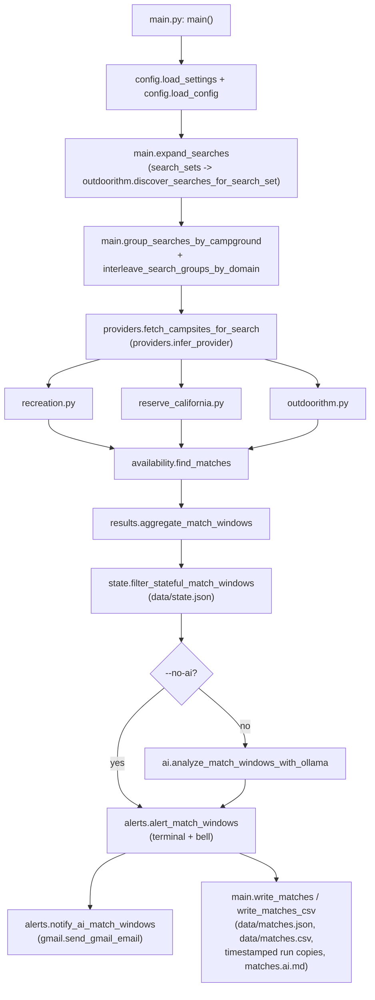

# Campsite Finder Architecture

The Campsite Finder Agent watches Recreation.gov, ReserveCalifornia, and (optionally) Outdoorithm for open campsites that match configured date windows and filters, then alerts on the terminal and/or by email. By default the agent only discovers and alerts; it never books a site. A small set of opt-in "get-site" tools can drive a real browser session up to (but never past) the final payment/confirm step, for a human to finish manually.

## Main Runtime Flow

The default `uv run campsite-finder-agent` invocation (`app.py` -> `main.main()`) runs one scan pass, or loops on an interval with `--watch`:

Step by step:

1. `main.py` parses CLI flags (each with a `Settings`-derived default) and loads `config/searches.yaml` via `config.load_config`, which merges top-level `filters` into every search.
2. `main.expand_searches` turns each configured `search_sets` entry into concrete `SearchConfig`s by calling Outdoorithm catalog discovery (`outdoorithm.discover_searches_for_search_set`); plain `searches` pass through unchanged.
3. `main.run_scan` groups searches by campground and interleaves groups across provider domains (`group_searches_by_campground`, `interleave_search_groups_by_domain`, `maybe_wait_between_network_searches`) so requests to the same site are spaced out and different domains are not hammered back-to-back.
4. For each search, `providers.fetch_campsites_for_search` calls `providers.infer_provider` (explicit `campground.provider`, else URL hostname) and dispatches to exactly one provider module. Providers return plain `Campsite` objects; nothing above this layer needs to know which site it came from.
5. `availability.find_matches` applies the search's `DateWindow` (including friendly relative dates like `+2weeks`), weekday rules, and `SiteFilters` to produce raw `Match` rows, one per campsite/check-in date.
6. `results.aggregate_match_windows` collapses those rows into `MatchWindow`s: one representative site per campground/check-in date, then merges consecutive check-in dates into a single window with a stable `state_key`.
7. `state.filter_stateful_match_windows` drops any `MatchWindow` whose `state_key` is already recorded as `ignored` or `booked` in `data/state.json`.
8. Unless `--no-ai` is set, `ai.analyze_match_windows_with_ollama` sends the remaining windows plus each search's `AIPreferences` to a local Ollama server and annotates them with a score, fit, reasons/concerns, and a suggested action. AI failures are caught in `main.py` and degrade to "no AI" rather than failing the scan.
9. `alerts.alert_match_windows` prints a table/summary and rings the terminal bell; `alerts.notify_ai_match_windows` additionally sends a Gmail alert for AI-scored windows above a threshold or with an allowed suggested action, de-duplicated against `data/notifications.json`.
10. `main.write_matches`/`write_matches_csv` write the current windows to `data/matches.json`/`data/matches.csv`, a timestamped run-id copy (`run_output_path`), and an `*.ai.md` summary when AI ran. With `--watch`, the loop repeats after `--interval-seconds`.

## Other Runtime Modes

`main.py` has no subcommands; behavior is selected by mutually exclusive flags checked at the top of `main()`, before the default scan loop:

- `--get-site` / `--get-recreation-site` / `--get-reservecalifornia-site` — booking-assist helpers. `--get-site` inspects the campground URL and delegates to `recreation.get_recreation_site` or `reserve_california.get_reserve_california_site`; the provider-specific flags call those directly. Both flows poll for a target site to open around a release time, fill in the reservation form (occupants, vehicle, camping unit, checkout address), and stop deliberately before completing a purchase: `recreation.py` never clicks the final Recreation.gov `Confirm` button (see `advance_recreation_cart_to_payment`), and `reserve_california.py` never enters ReserveCalifornia payment/card details. A human always finishes the booking.
- `--reservecalifornia-locks` — scans ReserveCalifornia's grid for "locked" (pre-release) site icons. With `--park-url` it runs an ad hoc scan of one park (`main.run_reserve_california_lock_scan` -> `reserve_california.fetch_locked_campsites`); without it, it runs every `locked_searches` entry from config (`main.run_configured_reserve_california_lock_scan`) and writes results the same way as a normal scan (matches JSON/CSV, optional AI summary and email alert).
- `--discover-state STATE` — calls `outdoorithm.discover_campground_catalog_for_state` and writes a JSON catalog of campground IDs/names for that state to `data/<STATE>.json`, to help build `search_sets` discovery filters.
- `--debug-reservecalifornia-network` — reloads the attached ReserveCalifornia tab and prints captured network JSON, for debugging selector/API drift.

## Provider Boundary

`providers.py` is the seam that keeps the rest of the app provider-agnostic:

- `providers.infer_provider(search)` returns a `Provider` enum value (`recreation.gov`, `reservecalifornia`, or `outdoorithm`), using `campground.provider` if set, otherwise matching the campground URL's hostname.
- `providers.fetch_campsites_for_search(...)` dispatches to exactly one of the three provider modules based on that result and returns `list[Campsite]`.
- `recreation.py` (Recreation.gov) attaches to a Chrome CDP session and fetches the monthly availability JSON that Recreation.gov's own site loads, retrying through rate limits (`RecreationRateLimitError`). It also owns the Recreation.gov booking-assist flow described above.
- `reserve_california.py` (ReserveCalifornia) attaches to the same kind of CDP session and reads the grid JSON that backs the calendar UI (`fetch_grid_campsites`, batched by date range), plus lock-icon metadata for pre-release sites (`parse_grid_locks`, `find_locked_matches`). It also owns the ReserveCalifornia booking-assist flow.
- `outdoorithm.py` (optional third provider) calls a direct HTTP API instead of a browser, gated by `OUTDOORITHM_API_KEY`. Beyond availability fetching, it also powers campground *discovery* for `search_sets` (`discover_searches_for_search_set`, `discover_campgrounds`, `discover_campground_catalog_for_state`).
- `browser.py` is a tiny shared helper (`require_playwright()`) that raises a friendly error if the `browser` extra isn't installed; each provider module implements its own page/tab discovery (`_find_recreation_page`, `_find_reserve_california_page`) rather than sharing browser plumbing here.

Everything downstream of provider fetch — `availability.py`, `results.py`, and most of `main.py` — only ever touches `Campsite`/`Match`/`MatchWindow`, so adding a new provider means adding one module plus one branch in `providers.py`.

## Configuration And Models

- `config.py` defines `Settings`, a `pydantic-settings` model backed by `.env` (`CAMPSITE_*`, `OLLAMA_*`, `OUTDOORITHM_API_KEY`, `GMAIL_*`), and `load_config()`, which reads `config/searches.yaml` into an `AppConfig` and merges any top-level `filters` into each search/locked search.
- `models.py` defines the typed contract between YAML config and the rest of the app: `Provider`, `CampgroundConfig`, `DateWindow` (with friendly relative-date parsing such as `+2weeks`/`tomorrow`), `SiteFilters`, `DiscoveryConfig`, `AlertConfig`, `AIPreferences`, `SearchConfig`/`LockedSearchConfig`/`SearchSetConfig`/`AppConfig`, and the result types `Campsite`, `Match`, and `MatchWindow` (the aggregated per-window record that carries AI fields and `state_key`).

## Cache, State, And Output Files

- `cache.py` is an offline/local-dev cache used by `--save-data`/`--use-saved-data`/`--save-raw-data` so repeated local test runs don't have to re-crawl providers. Cache files live under `data/cache/`, keyed by a hash of the campground URL and date range (`cache_file_for_campground`); `describe_cached_ranges` reports what's already cached.
- `state.py` reads/writes `data/state.json` (`ResultState`: `ignored` and `booked` lists keyed by `state_key`). `filter_stateful_match_windows` hides any `MatchWindow` whose key is already present. The AI layer can *suggest* a `suggested_state_action` (for example, "book"), but nothing in the code writes to `state.json` automatically today — updating it is a manual step, and a natural place for a future automation hook.
- `alerts.py` also keeps its own small dedupe file, `data/notifications.json`, recording which `state_key`s have already triggered an email alert so re-running a scan doesn't re-send mail for the same window.
- Concrete output files, all under `data/` and all git-ignored:
  - `matches.json` / `matches.csv` — latest visible availability windows, plus timestamped run-id copies from the same scan.
  - `matches.ai.md` — AI summary for the latest run, removed when AI didn't run or produced no output.
  - `locked-matches.json` / `locked-matches.csv` — output of `--reservecalifornia-locks`.
  - `raw/` — optional raw provider JSON dumps from `--save-raw-data`.
  - `cache/` — offline campsite cache described above.
  - `state.json`, `notifications.json` — the state and notification-dedupe files described above.

## Credentials And Local Secrets

- `.env` (git-ignored; `.env.example` checked in) holds every tunable: `CAMPSITE_*` paths/timings, `OLLAMA_BASE_URL`/`OLLAMA_MODEL`, `OUTDOORITHM_API_KEY`, and `GMAIL_*` paths/recipient. `config.Settings` reads it via `pydantic-settings`.
- `config/searches.yaml` (git-ignored; `config/searches.example.yaml` checked in) holds campground/search definitions. It contains no secrets but is treated as private local configuration.
- Recreation.gov and ReserveCalifornia authentication is never stored by this agent. Instead, it attaches to a Chrome instance you control via remote debugging (`task chrome`, `CAMPSITE_CDP_URL`) and, when a search needs a logged-in session, waits for a human to log in (`wait_for_recreation_login`, `wait_for_reserve_california_login`) rather than capturing credentials.
- Gmail alerting uses OAuth, not a password: `GMAIL_CREDENTIALS_PATH`/`GMAIL_TOKEN_PATH` (default `data/gmail_credentials.json` / `data/gmail_token.json`), the same pattern used by `gmail-inbox-agent`. `gmail.py` only requests the `gmail.send` scope and is used exclusively to send alert emails, never to read a mailbox.
- Outdoorithm access is a single `OUTDOORITHM_API_KEY` environment variable; see this agent's README for Outdoorithm attribution/licensing notes.
- `data/` is entirely git-ignored except `.gitkeep`, so cache files, `state.json`, `notifications.json`, matches output, Gmail credentials/token, and raw provider dumps never reach the repository.
- Booking-assist safety boundary: both `recreation.get_recreation_site` and `reserve_california.get_reserve_california_site` are designed to stop just short of completing a purchase — Recreation.gov's final `Confirm` is never clicked, and ReserveCalifornia's payment/card fields are never filled in. Finishing a reservation always requires a human in the loop.

## Testing Notes

The browser and HTTP layers (`recreation.py`, `reserve_california.py`, `outdoorithm.py`) are intentionally thin wrappers around each provider's page/API. The core decision logic in `availability.py` (matching) and `results.py` (window aggregation) has no network or browser dependency and is covered directly by unit tests (`tests/test_availability.py`, `tests/test_results.py`), so selector or API drift in a provider module can be diagnosed and fixed without needing Chrome, Recreation.gov, or ReserveCalifornia available. `tests/test_config.py`, `tests/test_state.py`, `tests/test_cache.py`, `tests/test_ai.py`, `tests/test_alerts.py`, and `tests/test_gmail.py` cover the remaining modules the same way.
