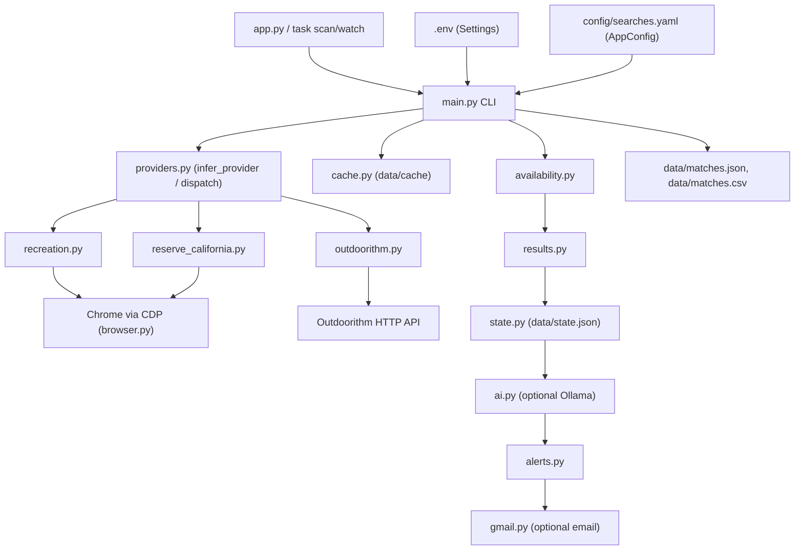

# Campsite Finder Architecture

This document is the living architecture reference for the Campsite Finder Agent. Keep it updated when providers, CLI modes, cache/state schemas, or credential handling change, per `AGENTS.md`. See `README.md` for setup and day-to-day usage.

## System Overview

The agent is a single Python CLI (`app.py` -> `campsite_finder_agent.main:main`) that reads local configuration, drives one or more provider modules to fetch campground availability, and reports matches:

Only `recreation.py`, `reserve_california.py`, and the Chrome/Playwright layer touch a real browser. Everything below `availability.py` in the diagram is plain Python operating on `Campsite`/`Match`/`MatchWindow` models and is exercised by unit tests without a browser or network access.

## Runtime Flow (Default Scan)

`main()` parses CLI flags (layered over `.env` defaults from `config.Settings`) and, for a default scan (`--once` or `--watch`), calls `run_scan` in a loop:

1. `config.load_config` reads `config/searches.yaml` into an `AppConfig` (`models.py`), merging top-level `filters` into each search and locked search.
2. `main.expand_searches` appends any `search_sets` entries: `outdoorithm.discover_searches_for_search_set` queries the Outdoorithm catalog/discovery API and turns matching campgrounds into ordinary `SearchConfig` objects alongside the explicit `searches` list.
3. `main.group_searches_by_campground` groups searches that hit the same campground URL and date window so the campground is fetched once even if several search rules apply to it; `main.interleave_search_groups_by_domain` then reorders groups so consecutive requests avoid hammering the same provider domain back-to-back.
4. For each group, `run_scan` either loads cached campsites (`--use-saved-data`, via `cache.load_cached_campground_campsites`) or calls `providers.fetch_campsites_for_search`, waiting `search_delay_seconds` between requests to the same domain (`main.maybe_wait_between_network_searches`) and honoring `request_delay_seconds`/`max_retries` for provider-level throttling and retry/backoff. With `--save-data`, freshly fetched results are written back to the cache (`cache.save_cached_campground_campsites`); with `--save-raw-data`, raw provider JSON is also captured under `data/raw`.
5. `availability.find_matches` filters each campground's `Campsite` list against a search's `DateWindow` and `SiteFilters`, producing raw `Match` rows (one row per campsite/check-in date combination).
6. `results.aggregate_match_windows` collapses raw matches into `MatchWindow`s: one representative site per campground/check-in date, with consecutive check-in dates merged into a single window so a long run of open dates does not flood the report.
7. `state.load_state` reads `data/state.json` and `state.filter_stateful_match_windows` drops any `MatchWindow` whose `state_key` is already recorded as `ignored` or `booked`, producing the "visible" matches for this run.
8. Unless `--no-ai` is set, `ai.analyze_match_windows_with_ollama` sends the visible windows (plus per-search `AIPreferences`) to a local Ollama model for scoring, fit/summary text, and a suggested state action; failures are logged as warnings and do not stop the run.
9. `alerts.alert_match_windows` prints a terminal summary and rings the terminal bell when there are visible matches; `alerts.notify_ai_match_windows` optionally sends a Gmail email for matches that clear an AI score threshold or match a suggested action, using `gmail.py`.
10. Results are written to `data/matches.json` and `data/matches.csv` (both a timestamped run copy and the "latest" copy), plus `data/matches.ai.md` when AI analysis ran. If no visible matches are found, the latest output files are removed instead of writing empty ones, so downstream consumers only ever see live-and-current data.

`--watch` repeats this loop on `--interval-seconds`; `--once` runs it a single time.

### Other CLI Modes

`main.py` is a single argparse CLI that also hosts several other modes, all reusing the provider/browser layer above:

- `--discover-state`: calls `outdoorithm.discover_campground_catalog_for_state` to write a state's Outdoorithm campground catalog to `data/<STATE>.json`, independent of `config/searches.yaml`.
- `--reservecalifornia-locks`: either scans a single `--park-url`/date range for ReserveCalifornia lock-icon slices (`reserve_california.fetch_locked_campsites` / `find_locked_matches`), or, without `--park-url`, runs the `locked_searches` entries from `config/searches.yaml` and writes `data/locked-matches.json`/`.csv` (with the same optional AI/email pipeline as a normal scan).
- `--get-site` / `--get-recreation-site` / `--get-reservecalifornia-site`: booking-assist helpers that poll a single campground/site for a specific stay near a release time and, once open, click through the provider's UI up to (but not including) submitting payment. `recreation.get_recreation_site` and `reserve_california.get_reserve_california_site` implement the provider-specific parts; `--get-site` infers which one to use from the campground URL.

These modes are driven by `Taskfile.yml` tasks (`scan`, `watch`, `hourly`, `locks:reservecalifornia`, `discover`, `get_site`, `get_recreation_site`, `practice_site`, ...) and, on macOS, two `launchd` plists for scheduled hourly scans and daily lock scans.

## Provider Boundary

`providers.py` is the seam a new data source plugs into:

- `infer_provider(search)` returns a `Provider` enum value, either from an explicit `campground.provider` in config or by matching the campground URL's hostname (`recreation.gov`, `reservecalifornia.com`, `outdoorithm.com`).
- `fetch_campsites_for_search(...)` dispatches to the matching provider module's `fetch_campsites_for_search`, all of which return a `list[Campsite]` for the same call shape (cdp url, login timeout, request delay, retries, optional raw-data path, optional retry logger).

Provider modules:

- `recreation.py`: browser-driven. Uses `browser.require_playwright()` to attach to an already-running Chrome instance over CDP (started with `task chrome`, so the user's own logged-in Recreation.gov session is reused rather than storing a password). From inside that browser context it calls Recreation.gov's internal month-availability JSON API directly (`availability.availability_api_url`), opening the campground page only when login is required or a fallback fetch is needed. It also implements the Recreation.gov side of the `get-site` booking-assist flow.
- `reserve_california.py`: also browser-driven over the same CDP session. It calls ReserveCalifornia's grid availability endpoint in 21-day batches from inside the browser context, parsing per-site daily availability (including the lock metadata used by the ReserveCalifornia lock-icon scan) instead of clicking through every possible date. It implements the ReserveCalifornia side of the `get-site`/lock-scan flows.
- `outdoorithm.py`: the one provider that does not need a browser at all. It calls the public Outdoorithm HTTP API directly with `OUTDOORITHM_API_KEY`, including retry/backoff on retryable status codes, and also implements the catalog-discovery and search-set-discovery helpers used by `--discover-state` and `search_sets`.
- `browser.py` is intentionally a thin, one-function wrapper (`require_playwright`) around importing Playwright's `sync_api`. Both browser-backed providers depend only on this seam, so the Playwright/CDP integration can be swapped or mocked without touching provider logic.

`availability.py` is provider-agnostic: it parses whatever `Campsite` list a provider returns and applies date-window/site filters, so this is the layer new provider tests target instead of mocking a browser.

## Cache, State, And Data Files

- `cache.py` implements an on-disk JSON cache used by `--save-data`/`--use-saved-data`. Cached campground data enables fast, offline reruns for explicit searches and ID-only search sets; discovery-based search sets may still call the Outdoorithm API before cache loading. Cache files are keyed by a short SHA-256 hash of either a search's identity (`cache_file_for_search`: name, campground URL, date window) or, for the default scan's per-campground grouping, the campground URL and date range (`cache_file_for_campground`). `describe_cached_ranges` summarizes what is already saved for a campground when a cache miss occurs. Raw provider JSON (distinct from parsed `Campsite` data) can also be captured separately under `data/raw` via `--save-raw-data`.
- `state.py` persists a small `ResultState` (`ignored`/`booked` lists of state keys or `{state_key: ...}` entries) at `data/state.json`. `filter_stateful_match_windows` removes any `MatchWindow` whose `state_key` is already ignored or booked, so previously handled matches stop showing up in future scans until the state file is edited.
- Other `data/` outputs: `matches.json`/`matches.csv` (latest + timestamped runs) and `matches.ai.md` from a default scan; `locked-matches.json`/`.csv` from `--reservecalifornia-locks`; `notifications.json` (`CAMPSITE_NOTIFICATION_STATE_PATH`) tracking which AI-scored matches have already triggered an email; `logs/` for cron/launchd output. All of `data/` is git-ignored.

## Credentials And Configuration

- `config.py` defines `Settings` (`pydantic-settings`), loaded from `.env` via `load_dotenv`, covering paths, timing/retry tuning, get-site defaults, Ollama, Outdoorithm, and Gmail alert settings. `load_settings()` also creates the `data/` subdirectories the agent writes to.
- `config.load_config` / `models.AppConfig` define the shape of `config/searches.yaml`: `searches`, `locked_searches`, `search_sets`, and top-level `filters` merged into each entry. `models.py` also defines the shared `Campsite`, `Match`, and `MatchWindow` schemas that flow between providers, `availability.py`, and `results.py`.
- Browser sessions never store a Recreation.gov or ReserveCalifornia password: `task chrome` starts a dedicated Chrome profile with CDP enabled, the user logs in manually once, and `recreation.py`/`reserve_california.py` simply attach to that running browser over `--cdp-url`.
- Optional Gmail email alerts use the same OAuth credential/token pattern as `gmail-inbox-agent` (`gmail.py`, `GMAIL_CREDENTIALS_PATH` / `GMAIL_TOKEN_PATH`, default `data/gmail_credentials.json` / `data/gmail_token.json`), not an SMTP password. `CAMPSITE_EMAIL_ALERTS_ENABLED`, `CAMPSITE_EMAIL_TO`, `CAMPSITE_AI_NOTIFY_MIN_SCORE`, and `CAMPSITE_AI_NOTIFY_ACTIONS` gate when an email is actually sent.
- `OUTDOORITHM_API_KEY` authenticates the Outdoorithm provider and discovery helpers.
- None of `.env`, `data/gmail_credentials*`, `data/gmail_token*`, or the rest of `data/` are committed; see the repository `.gitignore`.

## Testing Notes

`availability.py`, `results.py`, `cache.py`, `state.py`, `ai.py`, `alerts.py`, `gmail.py` (with mocked Google clients), and the parsing/config helpers in `providers.py`/`config.py`/`outdoorithm.py` are unit-testable without Chrome or real network access; see `tests/`. Keeping `recreation.py`/`reserve_california.py`'s browser-driving code thin and pushing parsing/matching logic into provider-agnostic modules is intentional, so selector or upstream API drift can be fixed without disturbing the core search rules.

## Non-Goals

The agent's default scan mode only discovers availability and alerts (terminal, bell, optional email); it never fetches or submits a reservation. The `get-site` / `get-recreation-site` / `get-reservecalifornia-site` booking-assist helpers are a deliberate exception used only when explicitly invoked for a specific site/date: they can click through a campsite's checkout flow, including entering order/occupant details, but they stop before submitting payment (Recreation.gov) or before entering card details (ReserveCalifornia). A human always completes the final booking step.

## Public Repo Change Management

Update this doc when a change affects:

- The provider boundary: a new provider module, a change to `providers.infer_provider`/`fetch_campsites_for_search`, or a new required call shape.
- The default scan pipeline: `expand_searches`, grouping/interleaving, `availability.find_matches`, `results.aggregate_match_windows`, or the AI/alert/state steps around it.
- A new or changed CLI mode in `main.py` (flags, `Taskfile.yml` tasks, or `launchd` plists).
- Cache or state file schema/location (`cache.py`, `state.py`, `data/*.json` formats).
- Credential handling: `.env`/`Settings` fields, Chrome CDP usage, Gmail OAuth files, or `OUTDOORITHM_API_KEY`.
