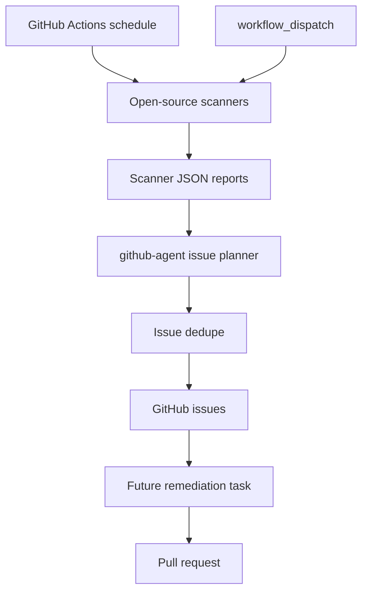
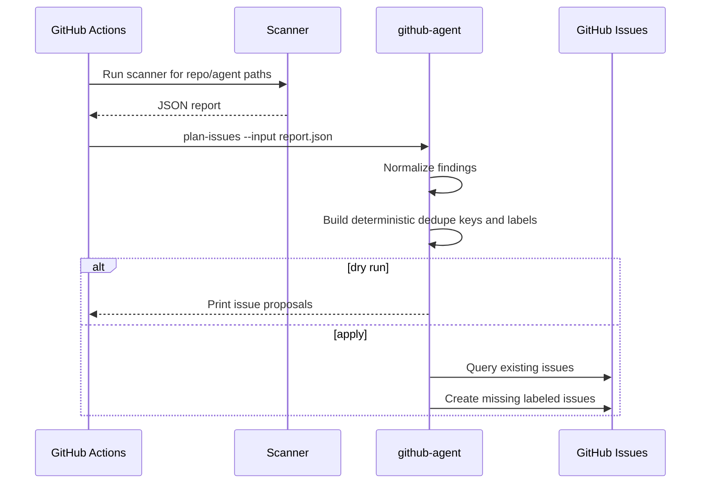
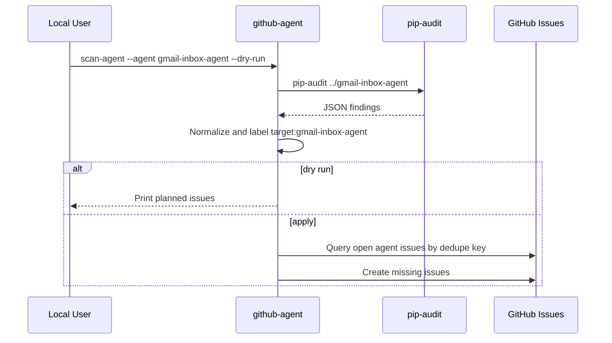
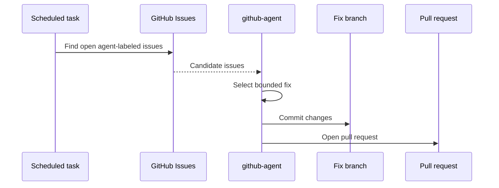

# GitHub Agent Architecture

This document is the living architecture reference for GitHub Agent. Keep it updated when scanner inputs, issue labels, GitHub permissions, scheduled workflows, or remediation behavior change.

## System Overview

## Finding Intake Sequence

## Local Agent Scan Sequence

## Future Remediation Sequence

## Safety Rules

- Default mode is dry-run.
- Scanner reports, tokens, logs, and runtime state stay out of Git.
- Issue creation must deduplicate before writing to GitHub.
- Remediation should create pull requests, not direct commits to `main`.
- Labels must be deterministic so humans and scheduled jobs can filter issues reliably.

## Labels

Initial labels:

- `agent:github-agent`
- `scanner:pip-audit`
- `scanner:trivy`
- `security`
- `maintenance`
- `severity:critical`
- `severity:high`
- `severity:medium`
- `severity:low`
- `severity:unknown`
- `target:gmail-inbox-agent`
- `target:github-agent`

## Public Repo Change Management

Update this doc when changing:

- Scanner tools or report formats.
- Issue label names.
- GitHub API permissions.
- Scheduled workflow behavior.
- Issue dedupe rules.
- Remediation or pull-request behavior.
