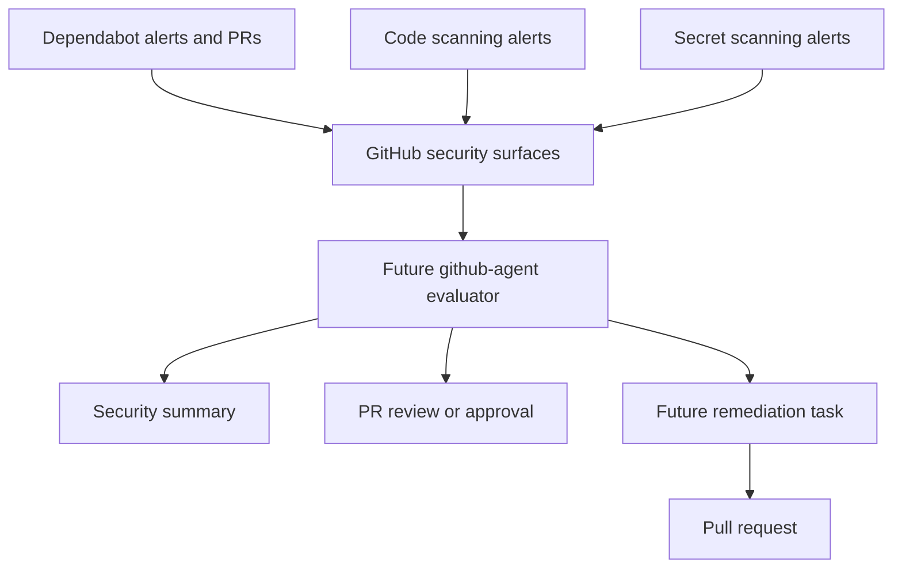
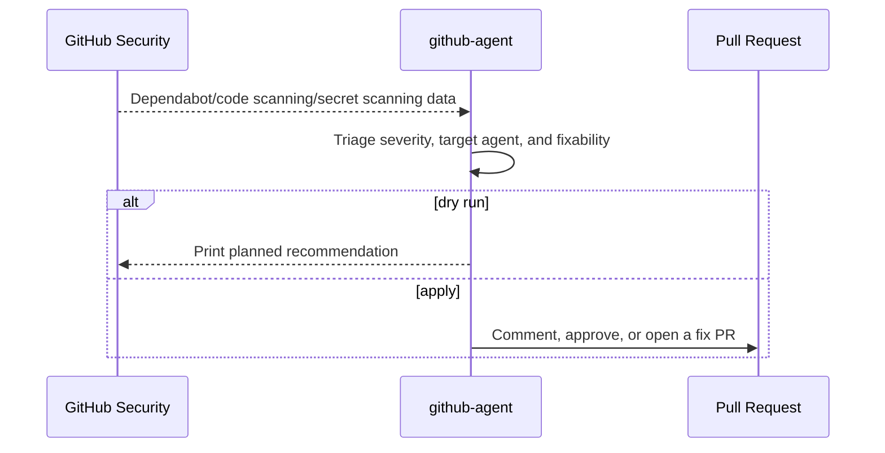
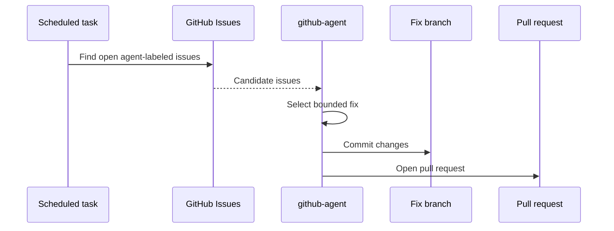

# GitHub Agent Architecture

This document is the living architecture reference for GitHub Agent. Keep it updated when GitHub alert sources, permissions, scheduled workflows, or remediation behavior change.

## System Overview

## Native Alert Evaluation Sequence

## Future Remediation Sequence

## Safety Rules

- Default mode is dry-run.
- Exported alert data, tokens, logs, and runtime state stay out of Git.
- Prefer GitHub-native alerts and PRs over duplicate scanner execution.
- Remediation should create pull requests, not direct commits to `main`.
- Labels and comments must be deterministic so humans and scheduled jobs can filter them reliably.

## Labels

Likely future labels:

- `agent:github-agent`
- `source:dependabot`
- `source:code-scanning`
- `source:secret-scanning`
- `security`
- `maintenance`
- `severity:critical`
- `severity:high`
- `severity:medium`
- `severity:low`
- `severity:unknown`
- `target:gmail-inbox-agent`
- `target:github-agent`

## Public Repo Change Management

Update this doc when changing:

- GitHub alert sources or API usage.
- Issue/PR label names.
- GitHub API permissions.
- Scheduled workflow behavior.
- Alert dedupe or grouping rules.
- Remediation or pull-request behavior.
