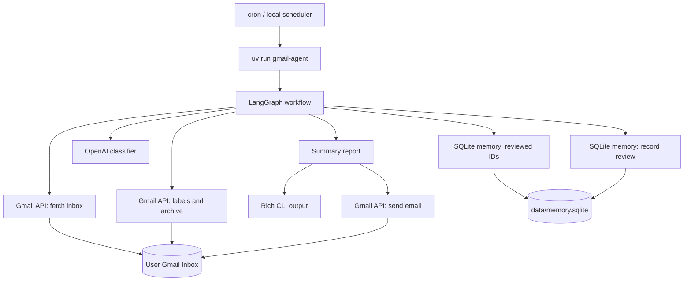
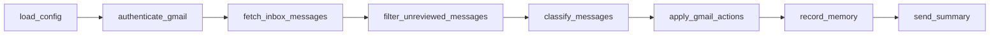
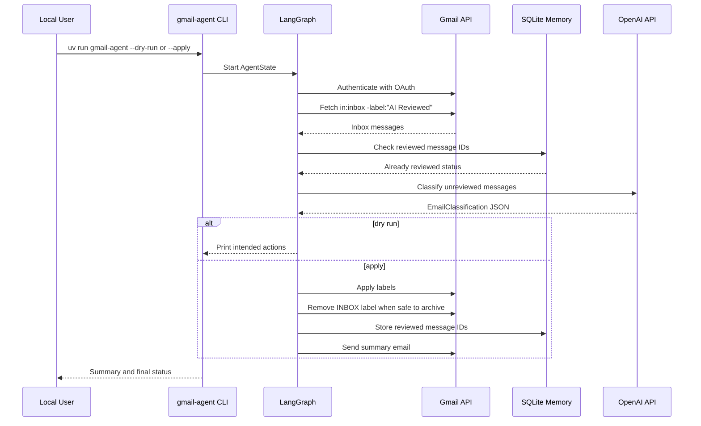
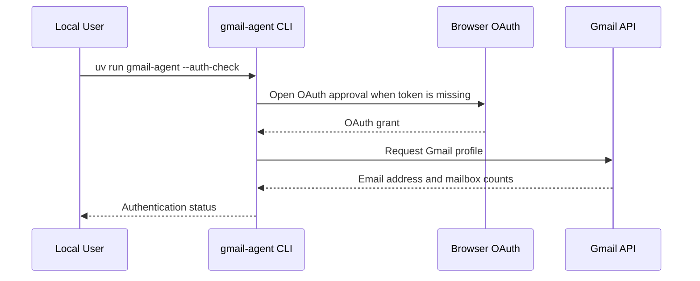
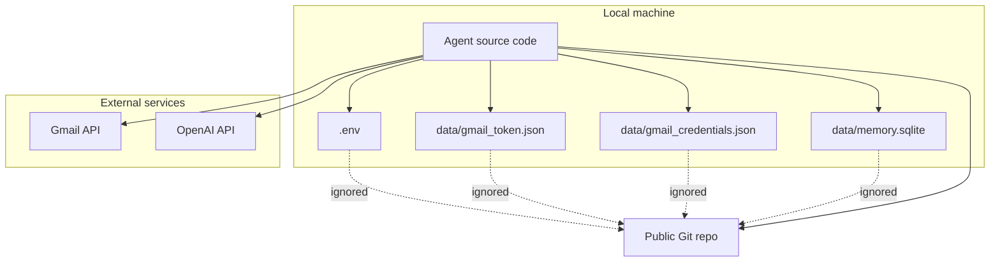

# Gmail Inbox Agent Architecture

This document is the living architecture reference for the Gmail Inbox Agent. Keep it updated when workflow steps, safety rules, labels, storage, infrastructure, or deployment automation change.

The original implementation spec lives in [Initial_Plan.md](./Initial_Plan.md). This file reflects the current implementation.

## System Overview

## LangGraph Workflow

The agent runs a linear workflow today. Each node receives and returns `AgentState`.

## Message Processing Sequence

## Gmail OAuth Check

## Data And Trust Boundaries

## Current Safety Rules

- Default mode is dry-run. The agent mutates Gmail only when `--apply` is passed.
- The agent fetches only messages in the Gmail inbox.
- Already reviewed mail is skipped using both `AI Reviewed` and SQLite memory.
- The agent never deletes, permanently removes, replies to, forwards, or marks messages as spam.
- Archive means removing the Gmail `INBOX` label.
- Low-confidence messages are not archived.
- Local credentials, OAuth tokens, SQLite memory, logs, virtualenvs, and caches are ignored by Git.

## Public Repo Change Management

When changing the agent, update this doc if the change affects:

- Workflow nodes or their order.
- Gmail scopes, labels, or mutation behavior.
- Memory schema or storage location.
- LLM prompts, classifier output schema, or model integration.
- Dry-run/apply safety behavior.
- Scheduling, containers, GitHub Actions, or deployment.
- OAuth setup or authentication behavior.

Keep implementation plans, milestone notes, and decision history under `docs/` so the public repo shows both the product and the engineering process behind it.
