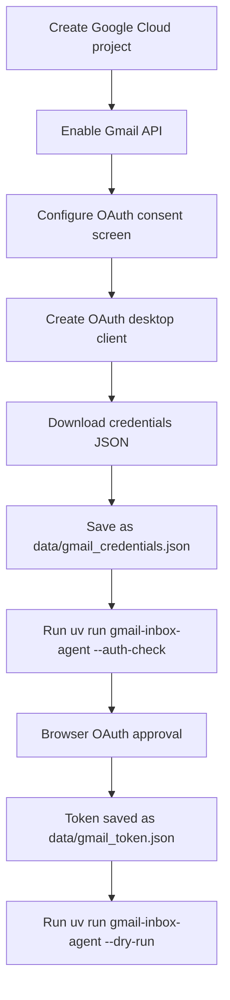

# Gmail OAuth Setup

This guide prepares local Gmail API access for real dry-runs and later controlled apply runs.

The agent uses OAuth, not password authentication. Keep downloaded credentials and generated tokens local; they are ignored by Git.

## Required Scopes

- `https://www.googleapis.com/auth/gmail.modify`
- `https://www.googleapis.com/auth/gmail.send`

`gmail.modify` lets the agent read inbox messages, apply labels, and archive by removing the `INBOX` label. `gmail.send` lets the agent send the summary report.

## Setup Flow



## Google Cloud Steps

1. Open the Google Cloud Console.
2. Create or select a project for this agent.
3. Enable the Gmail API for the project.
4. Configure the OAuth consent screen.
5. Add yourself as a test user if the app is in testing mode.
6. Create an OAuth client ID with application type `Desktop app`.
7. Download the client JSON.
8. Save it locally as:

```text
gmail-inbox-agent/data/gmail_credentials.json
```

Do not commit this file.

## Local Environment

Copy the example env file:

```bash
cp .env.example .env
```

Set at least:

```text
OPENAI_API_KEY=...
USER_EMAIL=your_email@gmail.com
GMAIL_CREDENTIALS_PATH=./data/gmail_credentials.json
GMAIL_TOKEN_PATH=./data/gmail_token.json
MEMORY_DB_PATH=./data/memory.sqlite
DRY_RUN=true
MAX_MESSAGES_PER_RUN=25
```

## Authenticate Gmail

From `gmail-inbox-agent/`, run:

```bash
uv run gmail-inbox-agent --auth-check
```

The first run opens a browser for Google OAuth approval. After approval, the agent writes:

```text
data/gmail_token.json
```

Do not commit this file.

## Real Dry-Run

Once auth works, run:

```bash
uv run gmail-inbox-agent --dry-run --max-messages 10
```

Dry-run mode can fetch and classify inbox messages, but it does not:

- Apply labels.
- Archive threads.
- Write reviewed-message memory.
- Send summary email.

## Controlled Apply

Only after reviewing dry-run output, run:

```bash
uv run gmail-inbox-agent --apply --max-messages 1
```

The agent still never deletes messages. Archive means removing the Gmail `INBOX` label from a thread.

## Public Repo Safety

These files must stay local:

- `.env`
- `data/gmail_credentials.json`
- `data/gmail_token.json`
- `data/memory.sqlite`
- logs and local run output

They are covered by `.gitignore`, but always check `git status` before pushing.

## Official References

- [Gmail API Python quickstart](https://developers.google.com/workspace/gmail/api/quickstart/python)
- [Gmail API OAuth scopes](https://developers.google.com/workspace/gmail/api/auth/scopes)
- [Google OAuth 2.0 overview](https://developers.google.com/identity/protocols/oauth2)
