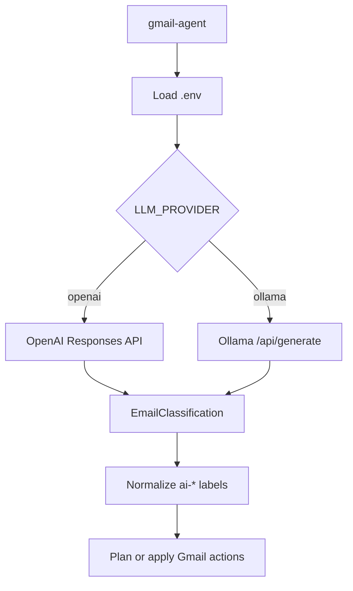

# LLM Providers

The agent supports configurable LLM providers for classification:

- OpenAI
- Ollama

Both providers must return JSON that validates as `EmailClassification`. The agent normalizes labels before applying Gmail actions.

## Configuration

Set the provider in `.env`:

```text
LLM_PROVIDER=openai
```

or:

```text
LLM_PROVIDER=ollama
```

## OpenAI

OpenAI is the default provider.

```text
LLM_PROVIDER=openai
OPENAI_API_KEY=...
OPENAI_MODEL=gpt-4.1-mini
```

If `LLM_PROVIDER=openai` but `OPENAI_API_KEY` is empty, the agent uses a conservative local heuristic fallback. That fallback is useful for smoke tests, but real classification quality needs an LLM provider.

## Ollama

Ollama runs locally.

```text
LLM_PROVIDER=ollama
OLLAMA_BASE_URL=http://localhost:11434
OLLAMA_MODEL=llama3.1:8b
```

Start Ollama and pull a model:

```bash
ollama pull llama3.1:8b
```

Then run:

```bash
uv run gmail-agent --dry-run --max-messages 10
```

The agent calls Ollama's `/api/generate` endpoint with:

- `stream=false`
- `format=<EmailClassification JSON schema>`
- `temperature=0`

## Provider Flow



## Choosing A Provider

Use OpenAI when you want:

- Stronger classification quality.
- Structured output support without local model setup.
- Better reasoning over messy email content.

Use Ollama when you want:

- Local inference.
- No email content sent to an external LLM provider.
- Lower marginal cost after local setup.

## Current Limitations

- Ollama quality depends heavily on the selected local model.
- The agent does not yet support provider-specific prompt templates.
- There is no retry or fallback chain yet, such as "try Ollama, then OpenAI."

## Official References

- [OpenAI API documentation](https://platform.openai.com/docs)
- [Ollama API documentation](https://github.com/ollama/ollama/blob/main/docs/api.md)
