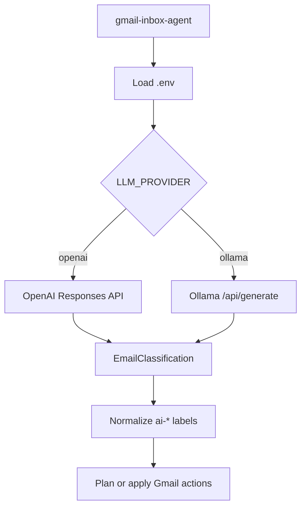

# LLM Providers

The agent supports configurable classification providers:

- `hybrid` (Recommended): Fast System 1 triage with Laya (~33ms), falling back to OpenAI/Ollama (System 2) only when confidence is low.
- `laya`: Pure System 1 non-autoregressive decision engine with calibrated probabilities.
- `openai`: Generative LLM via OpenAI Responses API.
- `ollama`: Local generative LLM via Ollama API.

Both providers return decisions that validate as `EmailClassification`. The agent normalizes labels before applying Gmail actions.

## Configuration

Set the provider in `.env`:

```text
LLM_PROVIDER=hybrid
LAYA_CONFIDENCE_THRESHOLD=0.85
```

or:

```text
LLM_PROVIDER=laya
```

or:

```text
LLM_PROVIDER=openai
```

or:

```text
LLM_PROVIDER=ollama
```

## Laya (System 1 Decision Engine)

[Laya](https://laya.convaiinnovations.com/) is an open-weight, non-autoregressive decision model running in ~33ms with calibrated probabilities across 100+ languages.

```text
LLM_PROVIDER=laya
LAYA_MODEL_NAME=convaiinnovations/laya
LAYA_CONFIDENCE_THRESHOLD=0.85
```

Install:
```bash
pip install laya>=0.3.3
```

In `hybrid` mode, Laya evaluates incoming emails in ~33ms. If confidence meets or exceeds `LAYA_CONFIDENCE_THRESHOLD` (default: 0.85), the decision is applied immediately with zero token costs and sub-50ms latency. If confidence is below threshold, it falls back to OpenAI or Ollama for deep reasoning.

## OpenAI

OpenAI provides high-quality generative classification with structured output:

```text
LLM_PROVIDER=openai
OPENAI_API_KEY=...
OPENAI_MODEL=gpt-4.1-mini
```

If `LLM_PROVIDER=openai` but `OPENAI_API_KEY` is empty, the agent uses a conservative local heuristic fallback. That fallback is useful for smoke tests, but real classification quality needs an LLM provider.

## Ollama

Ollama runs locally.

```text
LLM_PROVIDER=ollama
OLLAMA_BASE_URL=http://localhost:11434
OLLAMA_MODEL=llama3.1:8b
```

Start Ollama and pull a model:

```bash
ollama pull llama3.1:8b
```

Then run:

```bash
uv run gmail-inbox-agent --dry-run --max-messages 10
```

The agent calls Ollama's `/api/generate` endpoint with:

- `stream=false`
- `format=<EmailClassification JSON schema>`
- `temperature=0`

## Provider Flow


```mermaid
flowchart TD
    A["gmail-inbox-agent"] --> B["Load .env"]
    B --> C{"LLM_PROVIDER"}
    C -->|openai| D["OpenAI Responses API"]
    C -->|ollama| E["Ollama /api/generate"]
    D --> F["EmailClassification"]
    E --> F
    F --> G["Normalize ai-* labels"]
    G --> H["Plan or apply Gmail actions"]
```

## Choosing A Provider

Use OpenAI when you want:

- Stronger classification quality.
- Structured output support without local model setup.
- Better reasoning over messy email content.

Use Ollama when you want:

- Local inference.
- No email content sent to an external LLM provider.
- Lower marginal cost after local setup.

## Current Limitations

- Ollama quality depends heavily on the selected local model.
- The agent does not yet support provider-specific prompt templates.
- There is no retry or fallback chain yet, such as "try Ollama, then OpenAI."

## Official References

- [OpenAI API documentation](https://platform.openai.com/docs)
- [Ollama API documentation](https://github.com/ollama/ollama/blob/main/docs/api.md)
