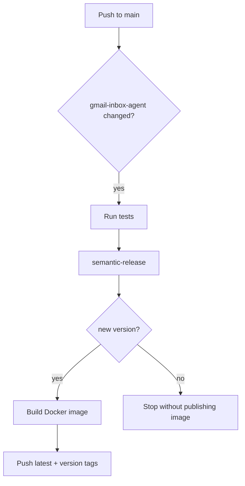

# Release And Docker Publishing

The Gmail Inbox Agent uses GitHub Actions, semantic-release, and Docker Buildx to publish Docker images to Docker Hub.

## What Triggers A Release

The workflow runs when changes land on `main` under:

- `gmail-inbox-agent/**`
- `.github/workflows/gmail-agent-release.yml`

Pull requests run tests only. Pushes to `main` run tests, then semantic-release.

## Versioning

Semantic-release creates GitHub releases and tags like:

```text
gmail-inbox-agent-v1.2.3
```

Conventional commit types control the version bump:

- `feat:` -> minor
- `fix:` -> patch
- `perf:` -> patch
- `refactor:` -> patch
- `docs:` -> patch
- `test:` -> patch
- `build:` -> patch
- `ci:` -> patch
- `chore:` -> patch
- breaking changes -> major

Example commits:

```text
feat(gmail-agent): add deterministic rules engine
fix(gmail-agent): skip agent summary emails
ci(gmail-agent): publish Docker image
```

Semantic-release only publishes when it can infer a release from commit messages. Use one of the conventional commit types above for Gmail agent changes that should publish a new Docker image.

## Docker Hub Tags

When semantic-release publishes a new version, the Docker job pushes:

```text
latest
1.2.3
v1.2.3
sha-<full-git-sha>
```

After publishing, run the image directly:

```bash
docker run --rm \
  --env-file .env \
  -e OLLAMA_BASE_URL="${DOCKER_OLLAMA_BASE_URL:-http://host.docker.internal:11434}" \
  --add-host=host.docker.internal:host-gateway \
  -v "$PWD/data:/app/data" \
  -v "$PWD/config:/app/config" \
  brandocomando8/gmail-inbox-agent:latest \
  --dry-run --max-messages 10
```

## Required GitHub Configuration

Add these repository variables:

```text
DOCKERHUB_USERNAME=brandocomando8
```

Add this repository secret:

```text
DOCKER_HUB_PAT=<docker-hub-access-token>
```

Use a Docker Hub access token rather than your account password.

## Workflow



## Official References

- [semantic-release](https://github.com/semantic-release/semantic-release)
- [semantic-release GitHub Action](https://github.com/cycjimmy/semantic-release-action)
- [Docker Build Push Action](https://github.com/docker/build-push-action)
- [Docker Login Action](https://github.com/docker/login-action)
