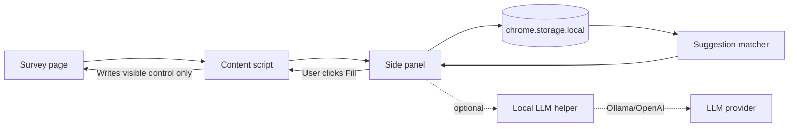
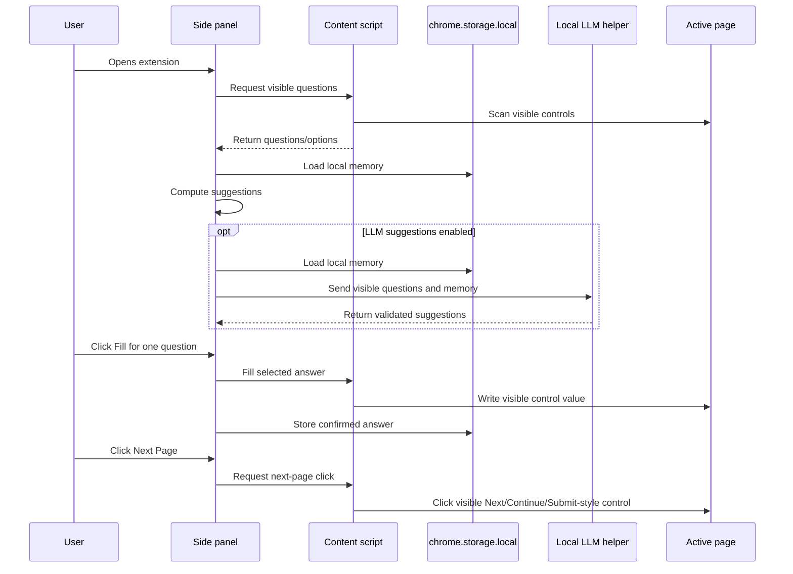

# Architecture

Survey Copilot Agent is a Chrome Manifest V3 extension with an optional local LLM helper. Detection, deterministic memory matching, and confirmed fill run in the browser. LLM suggestions use a local helper process so provider secrets are never stored in Chrome.

## Components

- `extension/manifest.json` declares the Chrome extension.
- `extension/content.js` scans visible controls and performs user-confirmed fills.
- `extension/sidepanel.html` hosts the review and memory UI.
- `extension/sidepanel.js` loads questions, renders suggestions, and stores confirmed answers.
- `extension/shared/normalize.js` normalizes question and option text.
- `extension/shared/memory.js` matches questions to stored memory.
- `extension/shared/llmClient.js` manages extension settings, domain allowlist checks, and optional local LLM helper calls.
- `server/llm-helper.js` serves `/health` and `/suggest` for Ollama or OpenAI.

## Question Flow

## Fill Rules

The content script only fills controls captured during the latest visible scan. It skips hidden, disabled, password, file, submit, reset, button, and image inputs during question filling.

The side panel also provides a user-confirmed `Next Page` action after detected questions. That action sends a separate request to the content script, which clicks only a visible, enabled control whose label is exactly Next, Next Page, Continue, Continue Survey, Submit, Done, or Finish.

The scanner handles native controls plus common custom survey widgets:

- `input`, `select`, and `textarea`
- `role="radio"`
- `role="checkbox"`
- `role="option"`
- open shadow roots

If no questions are found, the side panel reports scanner diagnostics for native controls, custom choices, visible iframes, and open shadow roots.

## Domain Allowlist

The extension content script is packaged for broad page compatibility, but the side panel refuses to scan or fill unless the active page URL matches the Settings allowlist.

Default allowed entries:

- `file:`
- `localhost`
- `127.0.0.1`

Users can add exact hosts such as `app.example.com` or wildcard hosts such as `*.example.com`.

## LLM Helper

The helper is optional and disabled by default. It accepts visible questions/options plus non-expired local memory and returns JSON suggestions. The prompt separates previous confirmed answers from reusable profile facts, asks the model to use those records as evidence, and keeps unsupported questions at `answer: null`. It validates model output before returning it to the extension:

- unknown question IDs are discarded
- choice answers must match a visible option
- suggested answers must match a non-expired confirmed answer or profile fact
- unsupported answers are returned as `answer: null`

Provider secrets stay in `.env` for the helper process. The extension only stores whether LLM suggestions are enabled and the local helper URL.

## Memory Keys

Confirmed answer memory is keyed by normalized question text plus a normalized signature of the visible answer options. This avoids reusing an answer when a survey repeats the same prompt with different choices.

Reusable profile facts are broader. They match question keywords first, then only suggest an answer if that answer matches one of the currently visible options.

The Memory tab can export the current memory object as a timestamped JSON file. Export uses the browser download flow from the side panel and does not include extension settings or LLM provider secrets.

## Future Ideas

- Manual import of profile facts.
- Review queue for stale or expiring memories.
- Browser-extension test harness with sample survey pages.
